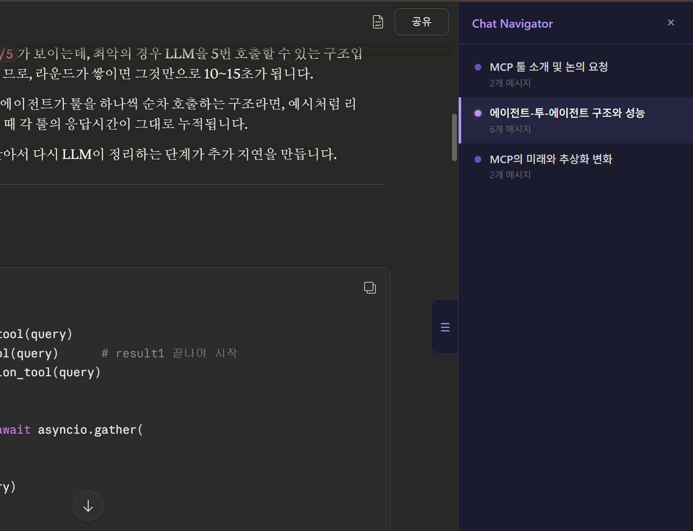

# Claude Chat Navigator



Claude.ai에서 긴 대화를 나누다 보면 이전에 어떤 이야기를 했는지 찾기가 어렵습니다. 이 불편함을 해결하고 싶어서 직접 만든 Chrome 확장프로그램입니다. 비슷한 도구가 이미 있을 수 있지만 직접 만들어보면 어떨까? 하는 호기심으로 시작한 프로젝트입니다.

## 이게 뭔가요?

LLM API를 활용하여 claude.ai 대화를 주제별로 자동 분류하고, 사이드바에서 원하는 주제로 바로 이동할 수 있게 해주는 확장프로그램입니다.


## 주요 기능

- **자동 주제 분류** — 대화 내용을 LLM이 분석하여 주제 단위로 묶어줍니다
- **사이드바 네비게이션** — 분류된 주제를 클릭하면 해당 위치로 스크롤
- **현재 위치 추적** — 스크롤에 따라 현재 보고 있는 주제가 자동 하이라이트
- **실시간 감지** — 새 메시지가 추가되면 자동으로 재분류
- **증분 분류** — 이전 분류 이후 충분한 메시지가 쌓였을 때만 API를 호출하여 비용 절감
- **OpenAI / Anthropic 지원** — 원하는 API 제공자와 모델을 선택 가능

## 프로젝트 구조

```
claude-chat-navigator/
├── manifest.json              # Chrome Extension 설정 (Manifest V3)
├── background/
│   └── service-worker.js      # LLM API 호출 처리 (OpenAI, Anthropic)
├── content/
│   ├── content.js             # 메인 오케스트레이터
│   ├── extractor.js           # 대화 메시지 추출
│   ├── classifier.js          # LLM 기반 주제 분류
│   ├── sidebar.js             # 사이드바 UI (Shadow DOM)
│   ├── sidebar.css            # 사이드바 스타일
│   ├── navigator.js           # 스크롤 & 주제 위치 추적
│   └── observer.js            # 새 메시지 감지 (MutationObserver)
├── popup/
│   ├── popup.html             # 설정 팝업 UI
│   ├── popup.js               # 설정 저장/불러오기
│   └── popup.css              # 팝업 스타일
├── shared/
│   ├── constants.js           # 셀렉터, 기본값, DOM 구조 탐색
│   └── storage.js             # chrome.storage 래퍼
└── icons/                     # 확장프로그램 아이콘
```

## 설치 방법

1. 이 저장소를 클론합니다
   ```bash
   git clone https://github.com/your-username/claude-chat-navigator.git
   ```
2. Chrome에서 `chrome://extensions` 로 이동
3. 우측 상단의 **개발자 모드** 활성화
4. **압축해제된 확장 프로그램을 로드합니다** 클릭
5. 클론한 폴더를 선택

## 사용 방법

1. 확장프로그램 아이콘을 클릭하여 API 제공자(OpenAI 또는 Anthropic)와 API Key를 설정
2. [claude.ai](https://claude.ai)에서 대화를 시작하면 우측에 사이드바가 나타남
3. 메시지가 2개 이상 쌓이면 자동으로 주제 분류 시작
4. 사이드바의 주제를 클릭하면 해당 위치로 이동

## 지원 모델

| 제공자 | 모델 |
|--------|------|
| OpenAI | gpt-5-mini, gpt-4o-mini, gpt-4o |
| Anthropic | claude-haiku-4-5, claude-sonnet-4-6 |

## 기술적 특징

- **빌드 도구 없음** — 순수 JavaScript로 작성되어 별도의 빌드 과정이 필요 없습니다
- **Shadow DOM** — 사이드바 UI가 claude.ai의 스타일과 충돌하지 않도록 격리
- **DOM 구조 자동 탐색** — CSS 클래스가 아닌 `data-testid`, `data-message-uuid` 등 안정적인 앵커를 기반으로 대화 구조를 탐색하여 claude.ai의 UI 변경에 강건함
- **SPA 대응** — URL 변경을 감지하여 페이지 이동 시 자동으로 재초기화
- **스트리밍 감지** — Claude의 응답이 스트리밍 중일 때는 분류를 대기

## 참고 사항

- LLM API 호출 시 비용이 발생합니다. 경량 모델(gpt-4o-mini, claude-haiku 등)을 추천합니다.
- claude.ai의 DOM 구조가 크게 변경되면 동작하지 않을 수 있습니다.

## 라이선스

MIT License
